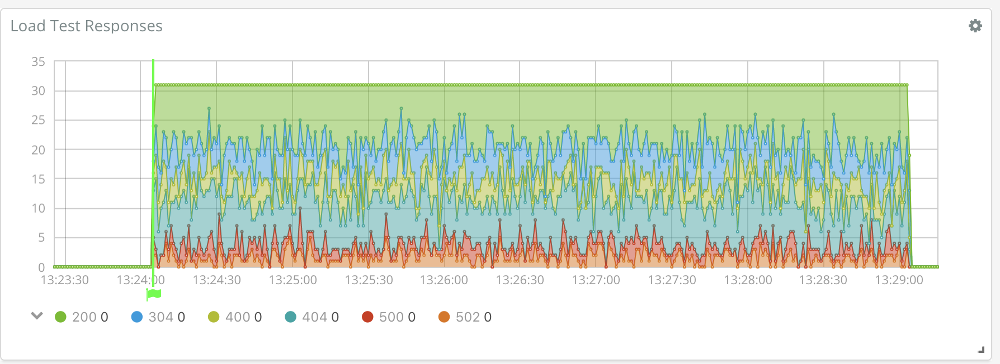
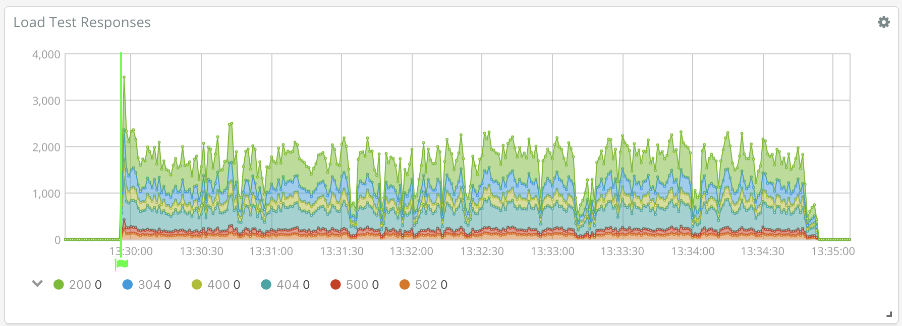

# Loadbeat

Welcome to Loadbeat, an HTTP load generator utilizing the Elastic Stack to analyze results.

## Using Loadbeat

### Target load profile



Create a load profile in yaml, eg `config.yml`.

This example will send `GET /health` no more than once per second and
`POST /v1/user` no more than 10 times per second per each of 3 workers (~30 QPS):

```yaml
loadbeat:
  targets:
    - concurrent: 1
      qps: 1
      method: GET
      url: health
    - concurrent: 3
      qps: 10
      method: POST
      url: v1/user
      headers:
        - Content-Type:application/json
      body: >
      	{"id": 12345}
```

Run loadbeat, using that profile as the configuration:

```
loadbeat -E loadbeat.base_urls=["http://load-test-target:8080/"] -e -c config.yml
```

### Testing limits



Set QPS to 0 to let loadbeat push as much traffic as it can.

### Discover

loadbeat generates two types of events:

  1. Results

  A result captures request and response data corresponding to an individual request:

  ```json
{
    "@timestamp": "2018-02-15T02:29:04.928Z",
    "beat": {
        "name": "localhost.localdomain",
        "hostname": "localhost.localdomain",
        "version": "7.0.0-alpha1"
    },
    "url": "/health",
    "bodysize": 0,
    "duration": 657720072,
    "trace": {
        "dns": 2968649,
        "request": 2512090,
        "response": 47751,
        "server": 650543614,
        "reused": false,
        "connection": 4589713
    },
    "code": 200,
    "method": "GET",
    "complete": true
}
  ```

  More details about HTTP tracing are available at https://blog.golang.org/http-tracing.

  2. Annotations

  A document is produced at the beginning of each run for each type of request that will be issued:

  ```json
{
    "@timestamp": "2018-02-20T18:29:56.596Z",
    "annotation": "GET http://load-test-target:8080/health - 0 (0 gz) bytes",
    "beat": {
        "name": "localhost",
        "hostname": "localhost",
        "version": "7.0.0-alpha1"
    }
}
  ```

  Annotations can be added to graphs created with the [time series visual builder (TSVB)](https://www.elastic.co/blog/master-time-with-kibanas-new-time-series-visual-builder).

## Getting Started with Loadbeat Development

Ensure that this folder is at the following location:
`${GOPATH}/src/github.com/graphaelli/loadbeat`

### Requirements

* [Golang](https://golang.org/dl/) 1.7

### Init Project
To get running with Loadbeat and also install the
dependencies, run the following command:

```
make setup
```

It will create a clean git history for each major step. Note that you can always rewrite the history if you wish before pushing your changes.

To push Loadbeat in the git repository, run the following commands:

```
git remote set-url origin https://github.com/graphaelli/loadbeat
git push origin master
```

For further development, check out the [beat developer guide](https://www.elastic.co/guide/en/beats/libbeat/current/new-beat.html).

### Build

To build the binary for Loadbeat run the command below. This will generate a binary
in the same directory with the name loadbeat.

```
make
```


### Run

To run Loadbeat with debugging output enabled, run:

```
./loadbeat -c loadbeat.yml -e -d "*"
```


### Test

To test Loadbeat, run the following command:

```
make testsuite
```

alternatively:
```
make unit-tests
make system-tests
make integration-tests
make coverage-report
```

The test coverage is reported in the folder `./build/coverage/`

### Update

Each beat has a template for the mapping in elasticsearch and a documentation for the fields
which is automatically generated based on `fields.yml` by running the following command.

```
make update
```


### Cleanup

To clean  Loadbeat source code, run the following commands:

```
make fmt
make simplify
```

To clean up the build directory and generated artifacts, run:

```
make clean
```


### Clone

To clone Loadbeat from the git repository, run the following commands:

```
mkdir -p ${GOPATH}/src/github.com/graphaelli/loadbeat
git clone https://github.com/graphaelli/loadbeat ${GOPATH}/src/github.com/graphaelli/loadbeat
```


For further development, check out the [beat developer guide](https://www.elastic.co/guide/en/beats/libbeat/current/new-beat.html).


## Packaging

The beat frameworks provides tools to crosscompile and package your beat for different platforms. This requires [docker](https://www.docker.com/) and vendoring as described above. To build packages of your beat, run the following command:

```
make package
```

This will fetch and create all images required for the build process. The hole process to finish can take several minutes.
